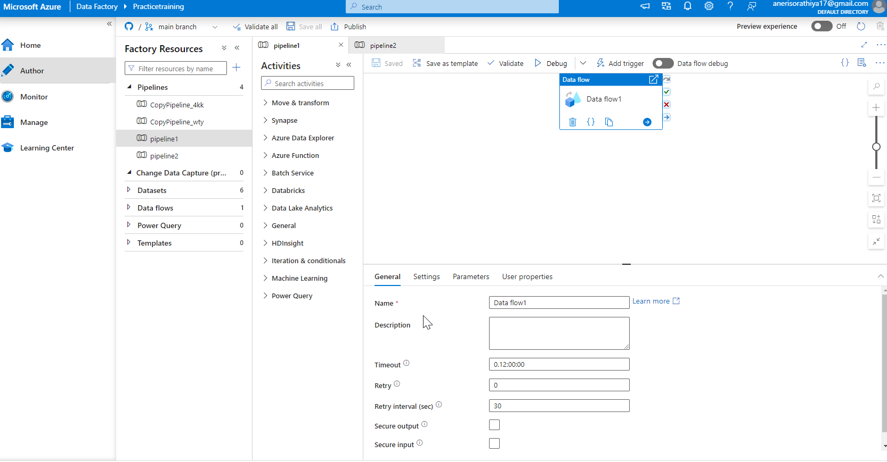

---
#AZURE DATA FACTORY
In Azure ADF reprsent as this logo:-

 

- Azure Data Factory is an enterprise-ready cloud-based hybrid data integration service that helps orchestrate data movement and operationalize data processing workflows (pipelines) at scale. 

#### Steps to create a new Azure Data Factory

>- The first step is to look for data factory for that you need to search in search bar "Data Factory" which will land you to this page.

>- The second step is to select your subscription and then the resource group if you have otherwise you can create a  new one by selecting "create new".

>- The third step is to give name to your data factory of your choice and select the region you want.

>- The fourth step is for Git configuration if you want to configure at this ppoint or you can tick the checkbox and do it later as shown below.

>- The fifth step is for Networking option you leave that as it is, make sure in connect via option "Public endpoint" is selected.

>- The final step is to click on "review + create" It will review that all things are perfect or not and then click on create option then you will see that your ADF is created and you can click on go to resources that will land you this page.

>- Then just click on Launch Studio and this will land you to the Data factory page which you have created.

Azure Data Factory is composed of a set of interconnected systems that provide an end-to-end platform for your data engineering needs, including:

#### Data Ingest 
>- ADF comes with 90+ standard connectors to simplify connection to diverse data sources and has a copy activity that simplifies the collection of data in a centralized location, for subsequent processing or transformation.

#### Mapping Data Flow 
>- ADF provides “code-free ETL”, enabling you to create and reuse data transformation graphs using a UI-based wizard. The transformation is done automagically on a Spark cluster, without requiring you to maintain or manage your own.

#### Azure Compute 
>- ADF can run code directly on any Azure compute, making it easy for you to handcraft your transformation routines and execute them as part of your data-driven workflow.

#### Data Ops 
>- ADF works with Azure DevOps and GitHub, making it easier for you to manage your data pipeline ops using your favorite platform. Plus, you have built-in activities to simplify data publication to Azure Data Warehouse, Azure SQL Database, or your favorite BI analytics engine.

#### Monitoring & Alerts 
>- ADF integrates seamlessly with Azure Monitor, API, PowerShell, and health panels on the Azure portal, making it possible for you to monitor the execution progress and health of your entire data pipeline at any time.

### ADF Main Page

>- On the left side of the screen, you can see the main navigation menu. Azure Data Factory consists of four main pages: Home, Author, Monitor, and Manage:

> 1. Home Page:- The Home page is a dashboard. From here, you can do some of the most common tasks

> 2. Author Page:- The Author page is your main development environment. This is where you will be spending most of your time during development. On the left side, you will see all your factory resources. (After we create some factory resources, that is. We’ll get back to that soon!) You also have a search bar at the very top of this page. From there, you can search for all your factory resources.

> 3. Monitor Page:- From here, you can view the overview dashboard, monitor your pipeline and trigger runs, view runtimes and sessions, and set up alerts.

> 4. Manage Page:- From here, you can manage connections, source control, triggers, parameters, and security.

### Overview of Azure Data Factory Components

>- Let’s go through each of these Azure Data Factory components and explain what they are and what they do.

#### Piplines
>- Pipelines are the things you execute or run in Azure Data Factory, similar to packages in SQL Server Integration Services (SSIS). This is where you define your workflow: what you want to do and in which order. For example, a pipeline can first copy and then transform data.

>- When you open a pipeline, you will see the pipeline authoring interface. On the left side, you will see a list of all the activities you can add to the pipeline. On the right side, you will see the design canvas. You can click on parameters, variables, settings, and output close to the bottom to expand those panes, or the properties button in the top right corner to view the pipeline properties and related pipelines.

Activity

>- Activities are the individual steps inside a pipeline, where each activity performs a single task. You can chain activities or run them in parallel. Activities can either control the flow inside a pipeline, move or transform data, or perform external tasks using services outside of Azure Data Factory.
>- You add an activity to a pipeline by dragging it onto the design canvas. When you click on an activity, it will be highlighted, and you will see the activity properties. These properties will be different for each type of activity.

#### Datasets

>- If you are copying or transforming data, you need to specify the format and location of the input and output data. Datasets are like named views that represent a database, a database table, a folder, or a single file.

>- When you create a dataset, you need to specify how to connect to that dataset. You do that using a linked service.

####Data Flows

>- Data Flows are a special type of activity for creating data transformations. You can transform data in multiple steps using a visual editor, without having to write any other code than data expressions

>- When you open a data flow, you will see the data flow authoring interface. The top part is the visual editor where you add data transformations. When you click on a data transformation, it will be highlighted, and you will see the data transformation settings in the bottom part. These settings will be different for each type of data transformation.

#### Power Query

>- Power Queries are a different type of activity for creating visual data transformations.

### Azure Data Factory Components on the Management Page

>- On the left side of the Management page, you will see components and services you can create and configure. We will focus on two of the core components in this post: linked services and triggers.

#### Linked Services

>- Linked Services are like connection strings. They define the connection information for data sources and services, as well as how to authenticate to them.

#### Triggers

>- Triggers determine when to execute a pipeline. You can execute a pipeline on a wall-clock schedule, in a periodic interval, or when an event happens.

###Summary of Author and Manage

>- You create pipelines to execute one or more activities. If an activity moves or transforms data, you define the input and output format in datasets. Then, you connect to the data sources or services through linked services. After you have created a pipeline, you can add triggers to automatically execute it at specific times or based on events.

